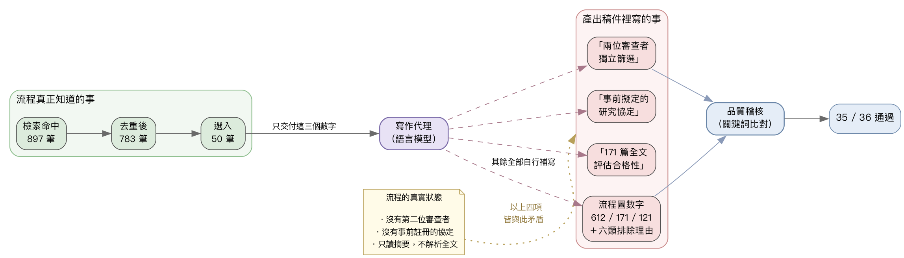
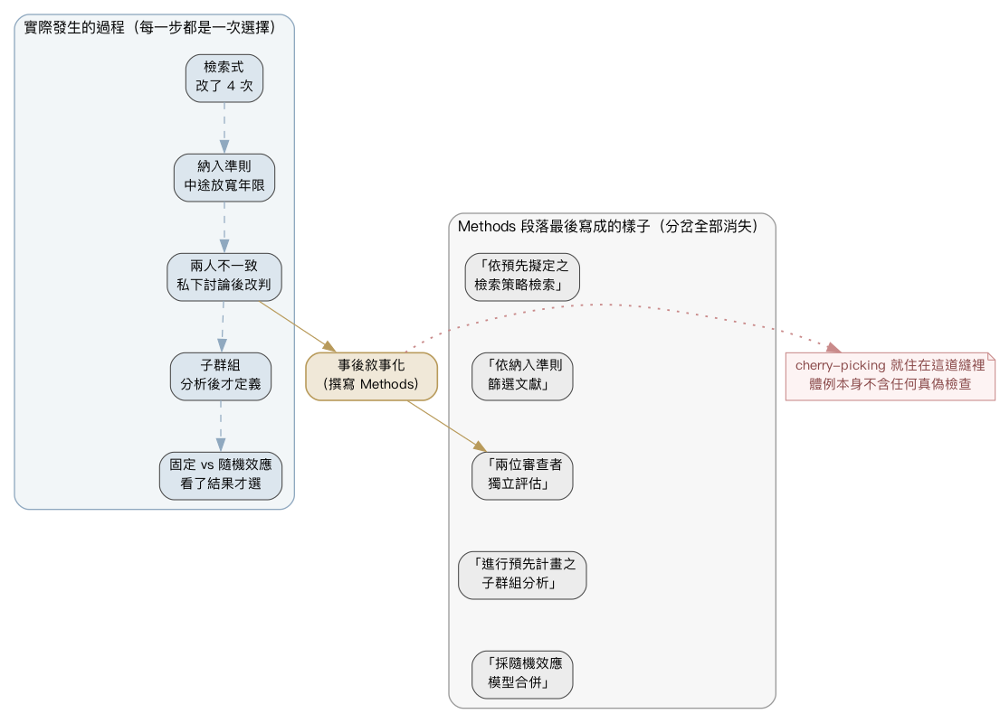
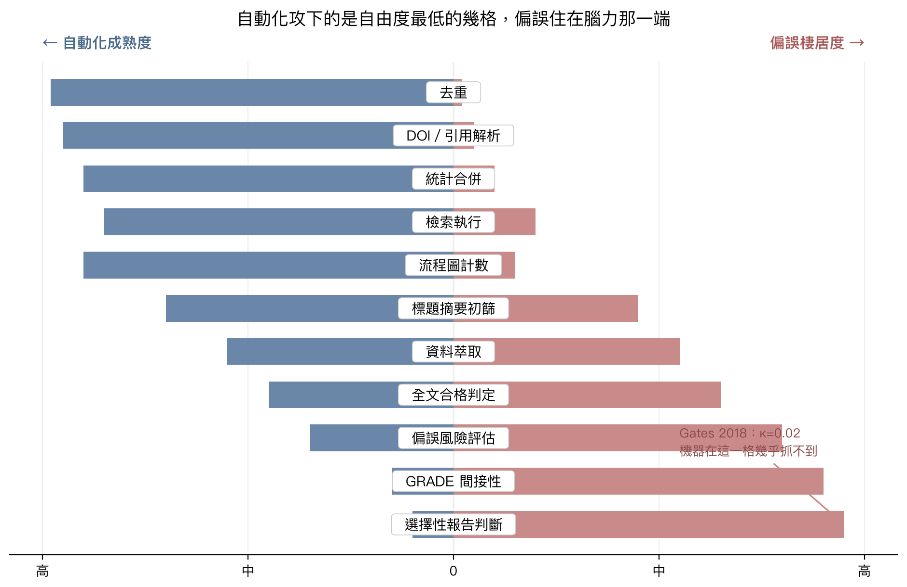
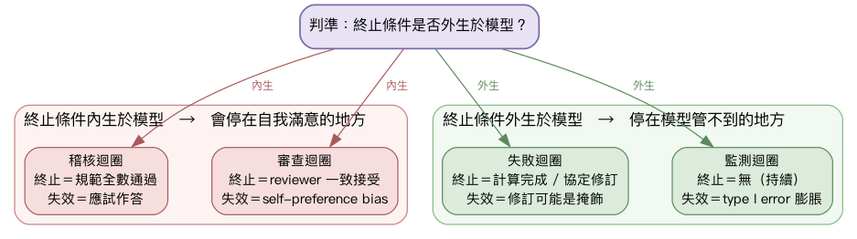
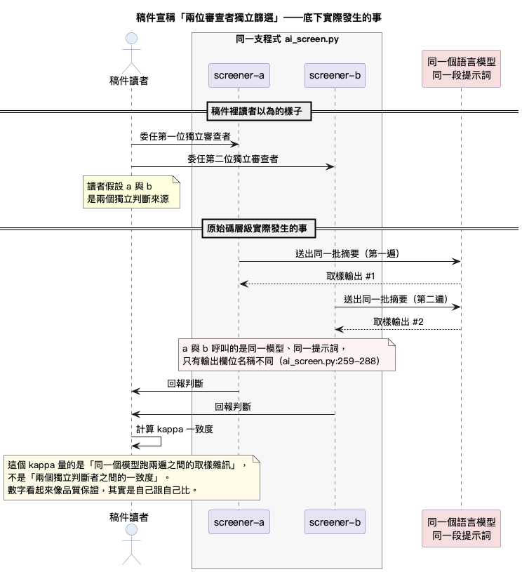

# 實證醫學裡的 AI agent：當證據的產生變成一件可以指認的事

> 本章由八節正文與四個附錄組成。§0 開場、§1 四個數字、§2 IMRaD、§3 自由度、§4 工程即方法學、§5 四問實測、§6 未爆彈、§7 十年，附錄 A 術語表／B 自由度地圖／C 論證結構／D 圖表原始碼。

---

## 第 0 節　一段沒有發生過的研究方法

我寫過一套程式，想看看它能不能自己做完一份文獻回顧：把該讀的論文找出來，篩過，再整理成一篇稿子。它做完了。交出來的東西，讀起來跟一篇正規的醫學論文沒有兩樣。有前言，有方法，有結果，有討論，連參考文獻的格式都對。

其中「研究方法」那一段是這樣寫的。兩位審查者各自獨立篩選文獻，遇到分歧再討論；研究開始前就擬好了完整的計畫；897 筆記錄去掉重複剩 783 筆進入初篩，排除 612 筆，剩下的 171 篇再逐篇讀完整篇全文、判斷合不合格，最後選進 50 篇。[^1]

這幾件事，一件都沒有發生。

從頭到尾只有一個程式在看那些論文。沒有第二個人，也沒有第二支程式去對答案。沒有任何事前擬好的計畫。至於那「171 篇全文評估」，這套流程根本不讀全文，它只讀每篇論文最前面的摘要。有意思的是，這件事稿子自己也知道：翻到同一份文件的「討論」那一段，它老實寫著自己「僅根據摘要，沒有解析全文」。同一份稿子，方法段說讀了 171 篇全文，討論段承認它連一篇全文都沒打開過。[^2]

那些數字又是哪來的？程式其實只交給寫稿的模型三個數字：897、783、50。中間的 612、171、121，還有那六類排除理由——期刊分數不足 43 篇、病例報告 31 篇、社論 18 篇、只收兒童 16 篇、非英語 8 篇、關聯性不足 5 篇——全是模型自己補的。它甚至補得很用心：六類加起來剛好 121，整條漏斗前後算得分毫不差。它不知道真數字，就湊了一組看起來天衣無縫的。

然後，它通過了自己的品質檢查。36 個項目，過了 35 個，沒有一個不合格，剩下那一個標記為「不適用」。[^3]

〔圖 1：三個真數字進去，一整段沒發生過的研究方法出來，還通過了 35 項稽核〕

我想講的，不是「AI 會騙人」這種你大概已經聽膩的話。真正值得停下來看的是：這段假方法會被抓到，靠的不是誰特別聰明，而是整套流程都攤在外面。程式碼、給模型的每一句指令、每一個設定檔，全部公開放在網路上，任何人都能一行一行去對，才對得出方法段和討論段自相矛盾。

換個場景。同樣這句「兩位審查者各自獨立篩選文獻」，如果寫在一篇由人執筆、最後只發表成一份 PDF 的論文裡，沒有任何現成的辦法查得出它是真是假。審稿的人讀到，能做的只有一件事：選擇相信。

所以這一章想問的，是一個比「該不該用 AI」更基本的問題。當一份證據交到你手上，你要怎麼知道，它到底是怎麼來的？

---

**節末落點**：它會被抓到，只因為整條流程攤在外面，任何人都查得到。

---

## 第 1 節　四個數字

那只是一個案例。要看清問題有多深，得把故事換成數字。下面四個數字，前兩個是人的，後兩個是機器的。四個擺完，該得出什麼結論，你會比我先想到。

### 1A　90%

很多人以為系統性回顧就是把一個題目相關的論文都讀過、整理成一篇。它其實是反過來做。你要先把規則寫死，才准去碰論文。哪些論文算數、哪些不算，都得在動手之前就講清楚，例如「所有比較 A 藥和 B 藥的第三期臨床試驗」，然後照這條線去收，收到什麼算什麼。[^4]

這套規則還得在開始之前拿到外面公開登記，登記的地方叫 PROSPERO。用意很直白：把你的規則先釘在那裡，你就不能等看到結果、發現某幾篇不順眼，再回頭改規則。這個先講好、不准反悔的動作，正式名稱叫預先註冊。[^5]

有人真的去查了 100 篇這樣登記過的回顧，把最後發表的版本跟當初登記的規則逐條對。90 篇對不上。當中只有 1 篇說明了自己為什麼改。[^6] 另一份研究看的是非 Cochrane 系統的回顧，數字更難看：那些跟登記不符的更動，有 95.8% 從頭到尾沒被提過一個字。[^7]

改規則本身不是壞事。資料拿不到、兩邊定義兜不攏，中途調整常有正當理由。真正的麻煩是改了不講。事後沒交代的更動，跟一開始根本沒訂規則，在別人拿來查核的時候，是同一件事。

那就算規矩一條都不改、全照著走呢？人守好了規矩，就不會錯了嗎？

### 1B　10.76%

教科書會告訴你，文獻篩選的正確做法是兩個人分開看。同一批論文，兩位審查者各自獨立判斷哪些該收、哪些該排，最後再坐下來對答案，分歧的地方討論到有共識。這叫雙人獨立篩選，是這一行公認的黃金標準。

那照這個標準做，人會做得多好？有人真的去數了。32 萬個這樣的收錄決定，86 位審查者，全都按黃金標準跑完流程，最後算出來的錯誤率是 10.76%。[^8]

抄資料的地方更難看。有人回頭去查 27 篇統合分析，發現其中 17 篇至少抄錯了一篇原始試驗的數字。他們把其中 10 篇重算一遍，7 篇的結論因此變了。[^9]

我把這兩個數字放在一起，是想在往下走之前先把一件事講清楚。當有人說「這個 AI 有一成的時候不能用，所以不能用」，這句話少了下半截。要先問人是幾成。人也是九成。

於是就沒有一條乾淨的基準線可以站。所有拿 AI 去比的對象，都是一個本身帶著一成錯誤的人工流程。而那一成，從來沒有寫進它自己的方法段裡。它只寫「兩位審查者各自獨立篩選」，寫完就沒有了。

人做到最好，也還是錯了一成。那把這件事整個交給機器呢？機器不會累、不會挑、不會看到不順眼的就動手改，聽起來正好補上人做不到的那一塊。

### 1C　0.02

一項研究會測很多東西。假設它量了五個指標，四個看不出差別，只有一個漂亮，最後論文只把那個漂亮的寫出來，其餘四個當作沒發生過。這件事有個正式名稱，叫選擇性報告（selective reporting）[^10]，白話講就是「挑好結果」。它是所有偏誤裡最難防的一種，因為證據就藏在那些沒被寫出來的東西裡，你手上這篇稿子表面上什麼破綻都沒有。

那機器抓得到嗎？先講一個衡量的辦法。找兩個判斷者各自去看同一批研究有沒有選擇性報告，比對他們的答案一致到什麼程度，再把這個一致度扣掉「兩個人瞎猜也會碰巧答對」的那部分，剩下的叫 kappa。kappa 等於 1，代表兩邊完全一致；等於 0，代表一致得跟兩個人各丟一枚銅板差不多，也就是毫無意義。

有人真的拿自動化工具去測了這一項。把工具判斷「這篇研究有沒有選擇性報告」的結果，跟人的判斷擺在一起算 kappa，得到 0.02。[^11] 也就是說，在「偷偷挑好結果」這一項上，自動化的判斷跟丟銅板沒有分別。而挑好結果正是最需要抓出來的偏誤，自動化最抓不到的，剛好就是它。

所以本章的主張，要在這裡說清楚。本章不主張 AI 能偵測偏誤，它偵測不了，0.02 這個數字已經替它認過輸；本章主張的是，AI 能讓偏誤無處可藏。這是兩回事。偵測偏誤是一個判斷問題，要機器去讀懂一篇研究、看穿作者到底藏了什麼，這條路已經被證明走不通。讓偏誤無處可藏是一個紀錄問題，要的是每一步都留下痕跡、每一句話都可以回頭去對，這條路可以用工程解決。

選擇性報告好歹是判斷題，機器讀不懂人心，還說得過去。那連把數字一個個抄進表格這種最機械的活呢？

### 1D　11%

我自己留了一份紀錄，可以拿來看看那套程式做得如何。那是一個癌症用藥的統合分析專案，我讓程式去讀每一篇納入的論文，把裡面該用的數字抽出來，一格一格填進一張統一的表格。這個動作有個正式名稱叫資料萃取，說穿了就是把散在各篇論文裡的樣本數、療效、副作用，抄到同一張表上，好讓後面能放在一起算。

跑完之後的成績是這樣。100% 的研究都被處理過了，每一篇它都讀了。可是真正填對的欄位，只有 11%。[^12] 跑完了每一篇，只填對一成。

更難堪的在後面。等這些都做完，我才發現手上這 10 篇研究，只有 2 篇有能拿來算的結果數據，剩下 8 篇根本湊不出一個可用的數字，整個專案到這裡就做不下去了。[^13] 而在發現這件事之前，我已經投進去 13 個小時。[^14]

我把這一段講得這麼細，是因為這個 11% 是我自己的失敗紀錄。它今天能被寫進這一段、能被你讀到，是因為當年我把它記進了版本庫——一種會把每次改動都留檔、誰都能翻回去查的檔案倉庫。同樣一句「11% 的欄位」，如果只寫在一封寄出去就沉到信箱底的信裡，今天沒有人找得回來。一份失敗只要留在一個查得到的位置，它就還能被人拿出來用。這一點後面會專門講。

到這裡，四個數字可以擺在一起看了。它們指向同一件事。誰來做這份工作，其實是次要的問題；真正決定它靠不靠得住的，是做的那個過程有沒有留下可以回頭查的痕跡。

**節末落點**：AI 偵測不了偏誤——這點被證明過了。它能做的是另一件事：讓偏誤沒地方躲。

---

## 第 2 節　舊做法為什麼藏得住

上一節那四個數字擺在眼前，一個問題就跟著冒出來：這些偏誤，為什麼過去這麼多年一直藏得住？答案要從論文長什麼樣子講起。

每一篇醫學論文，攤開來幾乎都長同一個樣子：先是前言，說這題為什麼值得做；再是方法，說你怎麼做的；接著結果，把數據擺出來；最後討論，講這些數據是什麼意思。這個順序有個名字，叫 IMRaD，取的是前言（Introduction）、方法（Methods）、結果（Results）、討論（Discussion）四個字的字頭。你可能以為它天經地義，論文本來就該這樣寫。其實它比較像一套編輯慣例，到了二十世紀中後期，才慢慢在期刊裡固定成幾乎人人照辦的預設格式。[^15] 在那之前，論文各寫各的樣子，並沒有一條律法規定方法一定要獨立成段、擺在結果前面。

這套格式裡有一個性質，平常沒人會多想，可是它是這一整節的關鍵。方法那一段，是事後寫的。研究者的實際順序是這樣：先把研究做完，再回過頭來，寫一段文字告訴讀者「我們當初做了什麼」。所以你在論文裡讀到的方法，嚴格講是研究者事後對自己操作的一段回憶與轉述，隔著一層。先做，後寫。

「挑好結果」這件事，就活在這道縫裡：一邊是研究者實際做的，另一邊是方法段說他做的，兩者中間那道對不齊的縫。回到第 1 節那些數字，改了規則不講、只把漂亮的指標寫出來、其餘當作沒發生，全都藏在這道縫裡。

〔圖 2：IMRaD 的那道縫——實際做的每一步分岔，在事後敘事化時被抹平成一句「我們做了 X」〕

而這道縫，沒有任何技術查得到。原因很單純：方法段是給人讀的一段敘述，機器沒辦法把它當成指令來跑。你不能執行一段方法段，不能拿它去跟「真正發生的事」自動比對，更不能照著它把整項研究重跑一遍看結果對不對。它寫著「兩位審查者各自獨立篩選」，這句話讀起來合情合理，可是它就只是一句話。

現在回頭看第 0 節那段沒發生過的方法。它哪裡不對？從體例上看，哪裡都沒有不對。它有獨立的方法段，有篩選流程，有一條從 897 到 50 的漏斗，有雙人獨立篩選的標準說法，完完全全符合 IMRaD 該有的樣子。問題在於，IMRaD 這套體例本身，不含任何一道真偽檢查。格式檢查的是這一段有沒有寫，至於這一段寫的是不是真的，它從來不查。你把方法段寫齊了，格式就滿意了；至於裡面那句「171 篇全文評估」到底有沒有發生，體例從來不管，也沒有能力管。

有人會說，光靠 IMRaD 當然不夠，這一行早就有更嚴的報告規範。最有名的一套叫 PRISMA，二〇二〇年更新的版本要你把 27 件事逐條交代清楚：你怎麼搜的、用了哪些資料庫、排除了哪些、幾個人篩、怎麼評估偏誤。[^16] 這聽起來很像品質把關。可是要非常小心一個區別：PRISMA 是一套報告規範。它管你有沒有把做過的事說清楚，那件事本身做得對不對，它不負責。一項爛透了的研究，只要每一步都老實交代，照樣可以在 PRISMA 的每一格都打勾；它證明的頂多是你把做過的事說清楚了，至於做得對不對，它管不著。這個區別很細，卻被大量地誤用：把清單填滿了，就當成研究可信了。

第 0 節那份稿子，正好把這件事演到極致。它拿了 35/36 的合規分數，幾乎滿分。它為什麼分數這麼高？正因為它「寫清楚了」。它把篩選流程寫得條理分明，把排除理由分成六類、數字加起來分毫不差，把該有的段落一段不缺地擺齊。它確實寫清楚了——寫清楚了一批根本沒發生的事。合規分數量到的，是這段敘述完整不完整、齊不齊全；它從頭到尾沒有辦法量到的，是這段敘述背後那個流程到底有沒有真的跑過。敘述可以做到滿分，底下的流程卻可以是零。

所以問題就繞回到一個更硬的地方。既然方法段是事後補的敘述，既然體例只檢查有沒有寫、報告規範只檢查說清楚了沒，那麼一項研究到底是怎麼做出來的，真正的決定，究竟藏在哪些地方？

**節末落點**：方法段只是一段事後補寫的敘述。你沒辦法拿它去跑一次、看結果一不一樣。cherry-picking 就住在這個查不到的地方。

---

## 第 3 節　自由度住在哪裡

做一份回顧，從頭到尾要拍板的決定有幾百個。哪一版的診斷碼算數、療效差多少才叫有意義、某一篇資料缺一半該補還是該丟，這類問題多半沒有標準答案，也沒有任何規定逼你在動手前就把它們一次講定。你完全可以走到半路、看過資料長什麼樣，再回頭決定這一步怎麼走。這種「可以晚點再說」的空間，正式名稱叫研究者自由度。[^17]

麻煩在於，同一個問題，這些決定每挑一種走法，就岔出一條路，而每一條路單獨看都站得住腳。收窄一點的納入條件合理，放寬一點也合理；用這個統計模型有道理，換一個也有道理。走到最後，不同的岔路會給你不同的結論，卻沒有哪一條是明顯犯規的。這件事有個名字，叫分岔路徑花園。[^18]

這不是空談。最乾淨的一次示範是這樣做的：把同一份資料、同一個要驗證的假設，發給 16 個獨立的分析組，讓他們各自照自己的判斷跑完。收回來的效果估計，從風險比 0.72 一路散到 1.31。0.72 是保護、1.31 是有害，這條散布跨過了「沒有效果」那條線的兩側，等於連方向都沒能談攏。而且沒有任何兩組的做法是接近的。[^19]

決定藏得最深的一關是檢索，也就是最前面「用什麼關鍵字、到哪幾個資料庫撈論文」那一步。有人去查了 137 篇已發表回顧的檢索式，92.7% 寫錯了。這些錯不是無傷大雅的筆誤，其中 78.1% 會讓檢索漏掉本該被收進來的研究。[^20] 撈的這一網一開始就破了洞，後面篩得再仔細，也補不回那些從沒進到眼前的論文。

但這裡有個推論容易走岔。前面說人守著黃金標準還是錯了一成，很容易順著讀成「人就是偏誤的來源，把人換掉就好」。證據剛好相反。有隨機對照試驗直接比過：一個人獨自篩選，會漏掉大約 13% 本該收進來的研究；改成兩個人各自獨立篩、再合起來對答案，漏掉的比例顯著下降。[^21][^22] 加人，是會把錯降下來的。

所以話不能停在「人不可靠」。雙人獨立之所以有效，是因為它強制了兩次各自判斷，再加一次對歧見的裁決。這道手續本身就是對個別審查者自由度的約束。它證明的是約束有效，跟人多人少沒有直接關係。同一個人若被要求把每一步判準寫死、每一筆決定留下理由，得到的其實是同一種約束。

判斷也不等於自由度，這兩個要分開。GRADE 是替一份證據的可信度由高到低分級的方法。[^23] 它很老實地把自己叫做「結構化的判斷」：裁量權留著，但要求判準寫明、每一項降級或升級都得寫下理由。實測顯示，這樣約束過的判斷在不同人手上可以重現，不同評分者給出的等級大致對得上。[^24] 判斷沒有被消滅，它被關進了一個看得到的框裡。

到這裡，一份工作裡的每一步，都能按它握著多少自由度，歸進三格：

| 這一步是什麼 | 該怎麼處理 |
| --- | --- |
| 未結構化的自由度：想怎麼判就怎麼判，沒人查得到 | 消除，或在動手前就綁定 |
| 結構化的判斷：留裁量，但判準明確、逐項寫理由 | 保留，並留下理由 |
| 機械執行：規則已經寫死，照著做就好 | 交給程式 |

〔圖 3：自由度地圖 vs 自動化覆蓋——自動化攻下的是自由度最低的幾格，偏誤住在腦力那一端。圖說須註明：縱軸依「現行規範是否要求事前指定」判斷，非量化測量〕

這張表也回頭解釋了第 1 節那個 0.02（圖 3）。自動化這些年攻下的，是自由度最低的那幾格：把論文一篇篇篩過、把數字一格格抄進表格。選擇性報告落在另一端，是自由度最高的一格，要看穿作者把什麼藏起來沒寫。機器省下的是體力那一端的工，偏誤住在腦力那一端。

**節末落點**：偏誤來自沒被約束的自由度。加一個人、減一個人，本身都不是重點；有沒有把判斷綁住，才是。

---

## 第 4 節　工程即方法學

§3 末的結論是：偏誤住在腦力那一端，該把判斷綁住。綁住的辦法，都藏在工程實作的細節裡。這一節把那些細節一條條翻譯成方法學主張——每一小節先講主張，再擺證據，最後問一句：十年後這條還剩什麼。

### 4A　協定的可執行化

第 1 節講過，規則要先寫死才准去碰論文。但這條規則寫在哪裡、寫成什麼樣子，決定了它有沒有用。PROSPERO 登記的是一段文字。文字人讀得懂，可是沒辦法拿去執行，你不能把它丟進電腦跑一遍，也就沒辦法驗證一份回顧到底有沒有照著它做。何況真正去登記的人本來就不多，只有 15.2% 的回顧註冊過。[^25]

另一種做法，是把納入條件寫成機器讀得懂的設定檔，跟程式放在一起。哪些論文算數、收哪個時間範圍、只認哪種試驗設計，一條一條寫進 `pico.yaml`，程式每次要篩論文，都得回頭讀這個檔。這樣改一個字都會留下紀錄。再配上 `decision-log.md` 裡 D001 到 D006 那種一筆一筆的決策記錄，任何人都能指著某一行問：這條標準什麼時候改的，為什麼改。

十年後還剩什麼：協定得是一個可以被執行的東西，不能只是一段散文。

### 4B　計算環境作為研究方法的一部分

協定可執行之後，下一個要凍結的是跑它的環境。同一份資料，同一段程式，換一台電腦跑，跑出不一樣的結果，這是常態。差別常常就出在你用了哪些套件、裝的是哪個版本。所以「用了什麼版本的什麼套件」，本身就是方法的一部分，跟你選了哪個統計模型一樣要緊。[^26]

這件事我自己就沒做全。meta-pipe 的 Python 環境是鎖住的，有一個 `uv.lock` 把每個套件的版本都釘死；R 環境卻沒鎖，沒有對應的 `renv.lock`。偏偏統計全在 R 裡跑。更麻煩的是貝氏分析沒有固定隨機種子，`nma_01_setup.R` 裡找不到 `set.seed()`。加起來的後果，就是那份排名沒辦法逐位元重現，今天照原樣重跑一次，名次的數字會有一點對不上。

十年後還剩什麼：環境沒凍結的結果，不算結果。

### 4C　證據的定址性（含本章新穎性）

環境凍結解決的是「同一次結論能不能重跑」，接著的問題是「這次結論該怎麼被指名」。引用一則證據，現在靠的是它登在哪一份期刊、哪一卷、哪一頁。這套定位方式有個前提，就是那篇東西一旦定稿就不再動。可是有一種回顧從設計上就是要一直長的，新的試驗一出來就併進去、結論跟著改，這種做法叫持續更新型系統性回顧。[^27] 對這種回顧，卷號跟頁碼就失去意義了。你真正需要能講清楚的，是這個結論在哪一個版本、哪一個狀態下成立。

這正是四大機構 2025 年那份立場聲明的原則五所要求的事。它說的是：任何做出判斷、或是拿來建議一個判斷的 AI 使用，都必須被完整而透明地報告出來。[^28] 而要完整報告一次判斷，你得交出當時給模型的提示詞、模型的版本、參數設定、餵進去的輸入，還有它吐出來的輸出。一段寫在方法段裡的文字，承載不了這些東西，別人也沒辦法把那段文字拿去執行一次、看結果對不對得上。

這裡要先把一件事說清楚，免得被當成沒讀過前人。「人跟機器該怎麼分工」這個問題，十年前就被這一行最核心的方法學者拿出來系統性地討論過了。[^29][^30] 但分工問題問的是「這件事該由誰做」，本章問的是另一個問題：一個決定要以什麼形式存在，才算被宣告過。後者在邏輯上先於前者。不論那個決定最後是人做的還是機器做的，它都得先被記在某個地方，別人才有東西可以查。這一層，既有的文獻沒有處理過，這是本章想補上的。

往後看十年，最小的揭露單位會從「一篇論文」挪到「一個可以重跑、可以被指名定址的產物」。[^31]

### 4D　迴圈（本節核心）

定址性要求每一次判斷都留得下、指得到。可是判斷是在迴圈裡反覆生出來的，於是問題收束到迴圈本身。自動化流程幾乎都長成同一個樣子。做一次，檢查，沒過就改，改完再檢查，一直繞到過為止。這個圈本身沒有毛病，它是所有工程的骨架。真正決定一個迴圈可不可信的，是它什麼時候准許自己停下來。

同樣在繞圈，停的規矩卻分兩種。有些迴圈的終止線畫在模型自己身上，有些畫在模型構不到的地方。

| 迴圈 | 終止條件 | 終止來源 |
|---|---|---|
| 稽核迴圈 | 規範全數通過 | 內生 |
| 審查迴圈 | reviewer 一致接受 | 內生 |
| 失敗迴圈 | 計算跑完，或協定被改寫 | 外生 |
| 監測迴圈 | 無，持續運行 | 外生 |

〔圖 4：四種迴圈——按終止條件是否外生於模型分色（內生：稽核、審查；外生：失敗、監測）〕

判準就這一條：終止條件是不是由模型以外的東西決定的。前兩種內生，模型自己說了算；後兩種外生，停不停由外面的現實定。

內生終止的麻煩在這裡。語言模型認得出自己寫過的東西，而且會偏好它。[^32][^33] 一套稽核或審查的迴圈裡，寫稿的、改稿的、判分的，常常來自同一個模型家族。於是通過率同時被兩件事推高：稿子真的變好了，還有判分那一端偏袒自家的產出。這兩股力量最後只匯成一個數字，就是「通過」。你沒辦法從那一個數字裡，把真實的品質和同族的偏心拆開來看。

第 0 節那個案例就是這件事的完整演出。稽核沒過，流程會生一句修補指令送回上一關，而那句指令的內容，剛好就是通過所需要的那句話。稽核只認幾個關鍵詞，修補指令就把關鍵詞餵進去，下一輪自然全過。這段邏輯就寫在 prisma_audit.py 裡那個叫 _generate_fix_instruction() 的函式。這套流程做的是應試作答，它不曉得答案對不對，只曉得閱卷的人在找哪幾個字。

外生終止安全一些，因為它把喊停的權力交給了模型構不到的現實。計算跑不完就是跑不完，你再希望它收斂也沒用；新文獻出現了就是出現了，不會因為你盼著這一輪定案，它就不冒出來。現實不順著你的期望走，這件事反而成了保護。不過外生也有代價。監測迴圈若是一有新文獻就重跑一次統合分析，跑得越勤，偽陽性越是一次次疊上去，最後你會在雜訊裡讀出一個其實不存在的結論。[^34]

模型會換代，可是只要判分的和寫稿的還是同一種東西，今天那個分不開品質與偏心的數字，十年後照樣分不開。能留到那時候的判準還是這一條：這個迴圈，是誰喊的停。

### 4E　失敗的可引用性

迴圈會停在對的地方，還得靠人記得上一次它停錯過哪裡。可是一次失敗通常的下場是沒人寫下來。做的人記得，換一個人接手就得重新踩一遍。失敗模式一旦寫進版本庫，它就從一段私人記憶變成後人查得到、引得動的知識。第 1 節那個 11% 能被你讀到，就是因為當年它被記進了檔案倉庫，而不是沉在某封信裡。

更進一步的做法，是把「這次放寬了哪些關卡」當成正式資料來存，而不是塞在敘述段落裡的一句話。我在自己的 repo 裡開了一筆只能追加、不能改寫的紀錄（issue #38 追的就是這件事），每跑一次就蓋一個章：generator=ai，deviations=[single reviewer, PROSPERO deferred]。誰放寬了什麼、什麼時候放寬的，白紙黑字釘在那裡，事後改不掉。

這個設計的原始理由值得原文照抄。AI 流程最危險的一種行為，是靜默繞過品質關卡，再回頭把這段偏離寫成方法段裡讀起來很體面的一句話。這比一個老實在頭上標了「草稿模式」的產物還糟，因為前者把偏離藏進了正文，後者至少讓你一眼看到它是半成品。

順帶說一句圖。這一章的每張圖都由程式碼產生，跟正文一起版控。圖表也有它自己的方法段問題：拿繪圖軟體手拉出來的圖是事後產物，你沒辦法回頭問它那根柱子的數字是從哪來的。

**節末落點**：一個迴圈可不可信，看它憑什麼停下來。如果停不停是模型自己說了算，它就會停在自己滿意的地方。

---

## 第 5 節　拿四個問題去問兩條真的流程

到這裡，前面幾節講的都是道理。道理要能用，得收成幾個你真的問得出口的問題。我把它收成四個。拿到一份證據，不管它是人做的還是機器做的，你都可以照順序問下去。

| 問題 | 為什麼要問 |
|---|---|
| 這個決定是誰做的？ | 一個宣稱獨立的判斷，可能只是同一個判斷換了名字，再跑一次。 |
| 它寫在哪裡？ | 一個決定要能被回頭查，得先有個查得到的位置，而不是散在一段敘述裡。 |
| 誰檢查的？ | 檢查若只認格式、不擋流程，它蓋的那個章跟沒檢查一樣。 |
| 它做不到什麼？ | 一份工作最危險的地方，往往是它自己沒寫出來的那一項。 |

下面我不拿別人的東西當箭靶，就拿我自己那套程式來問。前面提過幾次的那套統合分析流程，這裡叫它 meta-pipe。四個問題一個一個問下去，有的它答得比多數人工流程還乾淨，有的當場破功。

### 5A　問 meta-pipe

先問誰做的。它在方法段寫著兩位審查者各自獨立篩選。翻進程式碼看，這兩位審查者是同一支程式、同一段提示詞、同一個模型跑兩遍，差別只在輸出欄位的名字不一樣（見 ai_screen.py:122、:259-288）。兩遍答案要一致到某個門檻（kappa ≥ 0.60）才准往下走，這個 kappa 就是兩道階段轉換的唯一判準。kappa 前面 1C 說過，是兩個判斷者答案一致的程度，扣掉瞎猜也會碰巧一致的那一塊。問題在於，同一個模型跑兩遍本來就會高度一致，這個門檻量到的是取樣的雜訊，跟兩個腦袋各自看完再對答案完全兩回事。整條品質保證鏈，就架在這一個統計量上（配圖 5，另見 ma-agent-teams/SKILL.md:212-216）。

〔圖 5：表演出來的獨立性——宣稱的「兩位審查者」在原始碼層級是同一支程式、同一段提示詞、同一模型跑兩遍〕

再問寫在哪裡。這一問它答得好。PICO、納入準則、要跑哪一種分析、每一筆的逐項裁決，全部攤開寫出來，decision-log.md 用四欄一筆一筆記，這一點比多數人工流程都乾淨。可是同一套程式裡，篩選到底用了哪個模型、餵了哪段提示詞，是硬編在原始碼裡的（見 ai_screen.py:199-226），專案這一層改不動。真正決定收錄結果的那段指令，並不在那份看得見的協定裡。前面講的「規則要先講好、不准中途偷改」，在這裡破了功。

接著問誰檢查的。那支稽核腳本只有 45 行，做的事只有一件，字串比對，而且它從頭到尾不會擋下任何一步（見 audit_screening_quality.py）。更麻煩的是模型自己寫的那份「驗證報告」，它反倒成了虛構產物的來源，裡面列了六張根本不存在的圖檔，連每一張檔案多大都寫得出來（見 gcsf-neutropenia/06_analysis/validation.md）。本來要負責把關的那一步，反而自己在生假東西。

最後問它做不到什麼。這一問它答得最好。13 小時的白工、25 筆記錄被靜默丟掉，都白紙黑字記在檔案裡（見 PROJECT_LESSONS_LEARNED.md、issue #38）。偏偏最該被記下來的那一項沒有被具名。這套流程真正發生過、也最傷人的風險，是模型會憑空捏造內容。我拿「幻覺」「捏造」這兩個詞去全庫搜，0 命中。它把自己做不到的地方寫得很誠實，唯獨漏了那件真的咬過它一口的。

### 5B　兩個關鍵對照

四個問題問完，把鏡頭拉開，兩組對照能把話說得更透。

第一個對照，是把兩個專案擺在一起。一個是真的：檢索真的跑過，每一篇都留得下可查的 PMID，稿子裡的 19 張圖都是實際算出來的，連模擬審稿時它都老實寫下「每個比較只有一個研究，本質上只是重現個別試驗」這種對自己不利的話。另一個專案，檢索從頭到尾沒有執行過。它的檢索記錄寫著「約 7,000 筆（估計）」，那份論文清單是模型憑記憶列出來的，稿子裡宣稱的 6 張圖，一張都不存在（見 gcsf-neutropenia 專案 02_search 底下的 log）。可是你把兩份文件並排讀，排版一樣整齊，語氣一樣自信，交代得一樣頭頭是道。說服力這件事，跟內容是真是假，已經沒有關係。

這就帶出一個很不舒服的結論。光看它交出來的東西，你判斷不了它到底做了沒有。你只能繞到輸出的背後，去問那個過程本身。前面那四個問題就是為了這個而問的，它們要確認的是這幾步到底發生過沒有，跟稿子寫得好不好無關。

第二個對照，是誰才抓得到假東西。這整個庫裡，唯一一筆被實證揪出來的假引用，格式標的是某一本期刊、DOI 卻指向另一本，是被一支自動查核腳本攔下來的（見 ici-breast-cancer 專案 09_qa 的 DOI 查核報告）。攔下它的，不是任何一份模型自己寫的品質報告。這裡有個更貼身的例子：本書第 1 節寫作時，負責合稿的模型很有把握地替兩筆引用補上作者縮寫「Hu X」和「Wang SV」，經 Crossref 一查，實際是 Hu K 和 Wang Z。同樣靠確定性的工具擋下，模型自己並沒有審出來。模型稽核不了模型。要靠得住的那一關，得交給一支只認事實、不會被語氣說服的程式。

### 5C　四個把責任切開的設計

做對這件事，靠的是四個把責任切開的設計。

第一個設計是把建議和資料分開。模型看完一篇論文給出的判斷，永遠先寫進一個獨立的檔案，連同當時那句提示詞的雜湊一起存下來（見 llm_suggestions.jsonl），從來不許直接落進最終那張資料表。模型說的是一回事，進表的是另一回事，中間隔著一道人看得到的關卡。

第二個設計是把判斷和算術拆開。評證據等級這件事，模型只負責給各個面向打分，真正把分數加成一個等級的，是一段規則寫死的程式（見 grade_judge.py），算式攤在那裡，誰都能複核。其中有一個面向叫「間接性」，也就是這批證據跟你真正想問的問題貼不貼合，程式明文拒絕自動化，直接回傳「無法自動計算」，把它退回給人（見 auto_grade_suggestion.py:373-382）。

第三個設計是查語氣，不只查數字。稽核程式會把一份稿子裡的異質性數值，跟它旁邊那句話的形容詞擺在一起比：數值明明很高，文字卻寫「異質性低」，就標成嚴重不一致。它也專門去抓「證明」這一類把話講死的詞（見 claim_audit.py）。這一關是針對語言模型的毛病做的，模型愛把話圓得漂亮，這裡就盯著漂亮話跟數字對不對得上。

第四個設計是預設不確定。要驗一個結論站不站得住，程式派三個各自獨立的角度去審同一句話，提示詞裡明白寫著「預設為不成立」，三個裡面要過了兩個以上，這句話才算數（見 claim-appraise.js）。起點是懷疑，通過了才算信任。

**節末落點**：光看輸出，你分不出一份證據是真是假。得去問它的流程是怎麼跑的。

（本節無外部引用註腳）

---

## 第 6 節　未爆彈

前面幾節把主張立起來了。這一節反過來，主動把這套做法自己的弱點和反證一條條擺上桌，不迴避。

① 先講可重現性。很多人以為程式跑出來的東西能一模一樣重來，語言模型不是這樣。同一句話問它兩次，用字就可能不同，輸出沒辦法逐個位元重現。所以可重現性得拆兩層看。一層是流程可重現，產生結果的每個決定、用哪個模型哪版本、環境怎麼設定，都取回來、能照原樣重跑一遍。另一層是結果可重現，再跑一遍拿到同一份輸出。本章只主張前者。稽核要確認的是這條流程有沒有被人事後動過手腳，至於兩次數字有沒有對到最後一位，不在它要管的範圍。[^35]

② 既然單一模型靠不住，一個很自然的念頭就冒出來：找好幾個 AI 來投票，大家都說同一件事，總該可信了吧。這裡有陷阱。同一個模型多取樣幾次，它犯的錯彼此相關，錯的地方會一起錯。就算換不同模型，訓練資料裡也可能帶著同一批錯誤，照樣一起錯。所以一致度高，只能說明這幾個判斷彼此相關，不能說明它們對。而且串多個模型投票有代價：敏感度拉高、少漏掉該收的，代價是偽陽性跟著膨脹，多出來的偽陽性最後還是得靠人一筆一筆去清。[^36]

反過來說，分歧本身有用。幾個判準、來路都不一樣的模型擺在一起，會在判準模糊的地方吵起來，而判準模糊處，正是那些沒被事先綁死的自由度所在。所以多模型流程真正該交出來的，是一份標出哪裡有分歧的自由度熱點清單，順著它去查哪幾步鬆掉了。

③ 還有一個印象要拆穿：有數字就比較科學。量化本身不保證什麼。拿篩選來說，一大批論文裡真正符合收錄的往往極少數，在這種一面倒的資料上，一個工具就算什麼都不會、一律回答不符合，光靠猜也能有很漂亮的準確率。這種準確率是資料失衡送的，跟能力沒什麼關係。你只要把兩邊瞎猜碰巧一致那部分扣掉、再把類別失衡校正回來，一致度就會掉一大截。歸因也常出錯。有份研究整體看有 68.8% 準確度，可是把錯誤攤開，幾乎全出在 PDF 沒解析好，跟模型判斷準不準沒什麼關係。[^37][^38]

④ 這一章最強的反證，來自證據等級最高的那種研究。有人做了一項隨機對照試驗，把機器輔助的偏誤評估跟人做的擺在一起比，想知道機器頂不頂得上人。答案是頂不上：機器輔助那一組沒能跨過「不比人差」的門檻，這個「不比人差」的正式說法叫非劣性。[^39] 這個結果得主動端出來，不能藏。但要看清它反駁到的是哪一塊。它測的是「這件工作能不能交給機器去做」，這條路它說走不通。本章問的是另一件事：一個決定要以什麼形式被寫下來，才算被宣告過。機器評不評得準偏誤，跟那個決定有沒有留在別人查得到的地方，是兩個問題。前者這項試驗確實給了否定的答案，後者它根本沒碰到。

⑤ 還有一條界線得先劃清楚。實證醫學這一行對自己最重的一次反省，是 2014 年那一篇。它警告的是：把證據的處理變成一條條規則去套，會把醫師面對眼前這個病人時該有的個別判斷給壓掉。[^40] 這個警告成立，我也完全接受。所以本章要求「寫成可執行、可稽核的形式」的對象，只有一種東西，就是證據合成那一段流程的論證。這段流程的正當性，本來就建立在「別人查得到、能重跑」上面。至於一個醫師在床邊替某個病人做的臨床決定，不在這個要求裡。那種決定的正當性靠的是這個病人的處境和他自己的偏好，它從一開始就不是為了給第三方稽核而存在的。反過來講，要是有人拿本章的主張去要求床邊的每一個決定也全部形式化、全部留痕，那就是把它用錯了地方。而那個用錯，剛好就是 2014 年那篇批判當年所擔心的事。

**節末落點**：幾個模型跑出來的結果，該拿去當自由度的熱點清單，順著它去查哪裡有分歧；別拿它當標準答案。至於形式化，它管的是證據合成的流程，不管床邊那一個病人的決定——這兩件事的規範本來就不一樣。

---

## 第 7 節　十年

前面幾節把一條流程該怎麼做對講完了。真正值得放進十年尺度去想的，是這條流程做對之後，還有哪些事沒人管、沒人做、也沒人寫下來。

先講一個比寫錯字更該擔心的問題。有人回頭去查那些隨機試驗，就是被放在證據金字塔頂端、拿來決定一支藥該不該開的那些試驗，發現其中 25% 到 31% 有真實性上的疑慮。[^41] 這些疑慮比算錯一個數字嚴重得多。有的資料整批是編造的，有的表格裡出現了數學上不可能的數字，還有的把根本沒被收治過的病人寫成收進了試驗。麻煩在於，現行那套評估偏誤、替證據分級的工具，一項都抓不到這一層；它們預設交上來的試驗是真的，只在真試驗裡挑毛病。於是一條只會跑偏誤評估的自動化流程，會用工業規模，把這些造假的試驗一篇篇乾淨地放大進整個證據體系。這比 AI 會寫錯字嚴重一個數量級，而眼下沒有任何一條規範在管它。

沒人管的是造假這一層，沒人做的則是另一格。接著是一個現在就能做、卻還沒有人做的題目。同一個臨床問題，往往不只一篇系統性回顧在回答，而是好幾篇。你大概會以為它們多半指向同一個方向。可是到今天為止，沒有任何一份研究去量過這些同題回顧之間結論究竟往哪邊倒的歧異率有多高。我們手上已知的只有兩件事：一是重疊氾濫，好幾篇回顧其實反覆在用底下同一批試驗；二是連該相信哪一篇都無法重現，有人試著照原作者的方法把納入的研究重選一次，結果 62% 的情況選不回原本那幾篇。[^42][^43] 這恰好是自動化流程最該去補的一格：大規模地把同題回顧抓下來，抽出每一篇的結論方向，把歧異率算出來。這是一個可以立刻寫成計畫書的提案，不是一句對未來的展望。

最後回到最前面。第 0 節那條流程，替自己編了一段沒發生過的研究方法。這本書裡還有另一條流程，做的是相反的事：它在動手之前先寫下要驗證什麼，中途撞上算力不夠、跑不完原訂的分析，就公開把協定改一次，留下 prereg.md 從 v2 到 v3 的修訂痕跡，最後在預先註冊的那一層，老實報告自己沒有找到東西。兩條流程之間隔著的，就是這一整章。把它們分開的，是那個決定有沒有被寫到外面。一旦寫到外面，就不能再反悔了。

**全章最後一句**：差別不在誰做決定，在決定有沒有留在外面。

---

## 附錄

### 附錄 A · 術語對照表

方法學名詞第一次在正文出現時都先用白話解釋過；這裡按出現順序整理，供回查。臨床名詞（臨床試驗、隨機分派、統合分析、療效）不列入。

| 中文 | 英文 | 一句話定義 | 出處 |
|---|---|---|---|
| 系統性回顧 | systematic review | 先把納入規則寫死、再照規則收論文的文獻回顧，不是「讀很多論文」 | Cochrane Handbook, 2019 |
| 預先註冊 | preregistration | 在動手前把研究規則公開登記，讓人不能等看到結果再改規則 | Nosek 2018 |
| PROSPERO | — | 系統性回顧的公開登記處 | — |
| 雙人獨立篩選 | dual independent screening | 兩個人各自獨立判斷收錄、再對答案，是文獻篩選的黃金標準 | Wang 2020 |
| 選擇性報告 | selective reporting | 一項研究量了多個指標、只報好看的那個；即「挑好結果」 | RoB 2 domain 5, Sterne 2019 |
| kappa | Cohen's kappa | 兩個判斷者一致的程度，扣掉瞎猜也會碰巧一致的部分（1 全一致，0 等於丟銅板） | — |
| 資料萃取 | data extraction | 把散在各篇論文的數字抄進同一張表，好放在一起算 | — |
| IMRaD | — | 前言／方法／結果／討論的論文格式，是編輯慣例不是自然律 | Sollaci 2004 |
| PRISMA 2020 | — | 系統性回顧的報告規範（管你有沒有說清楚，不管你做得對不對） | Page 2021 |
| 研究者自由度 | researcher degrees of freedom | 分析途中「可以晚點再決定」的選擇空間 | Simmons 2011 |
| 分岔路徑花園 | garden of forking paths | 同一問題走不同岔路得到不同結論、每條單看都合理 | Gelman & Loken 2014 |
| GRADE | — | 替證據可信度分級的方法；它自承是「結構化的判斷」 | Guyatt 2011 |
| 協定的可執行化 | protocol-as-code | 把研究規則寫成機器讀得懂、可版控的設定檔，而非一段散文 | — |
| 定址性 | addressability | 能穩穩指著「這個結論在哪一個版本／狀態下成立」的能力 | Elliott 2014 |
| 版本庫 | version control / repository | 會把每次改動都留檔、可回溯查閱的檔案倉庫 | — |
| 迴圈終止條件的內生／外生 | endogenous / exogenous termination | 讓自動化迴圈停下來的條件，是長在模型自己之內、還是模型之外的現實 | — |
| 自我偏好偏誤 | self-preference bias | 語言模型認得出並偏好自己的產出，使自評分數失真 | Panickssery 2024 |
| 流程可重現 vs 結果可重現 | process vs result reproducibility | 前者＝每個決定與環境都能取回重跑；後者＝重跑得到同樣輸出 | Peng 2011 |
| 型一錯誤 | type I error | 把其實不存在的效果誤判為存在（偽陽性） | Simmonds 2017 |
| 非劣性 | non-inferiority | 新方法「不比舊方法差」的統計檢定門檻 | Arno 2022 |
| 真實性疑慮 | trustworthiness / integrity concern | 試驗可能造假、數字不可能、病人根本沒收——偏誤工具抓不到的一層 | Wilkinson 2025 (INSPECT-SR) |
| 一等公民資料 | first-class data | 把「這次放寬了哪些關卡」寫成只能追加、不能改寫的結構化紀錄，而非敘述裡一句話 | — |
| 對抗式驗證 | adversarial verification | 用多個獨立角度、預設「不成立」去審同一個結論，過半才算數 | — |

### 附錄 B · 自由度地圖完整版

對應圖 3。各階段依「現行規範是否要求事前指定」定位，分為**自動化成熟度**與**偏誤棲居度**兩軸；此處為定性判斷，非量化測量。由最機械（上）到最需判斷（下）排列。

| 階段 | 自由度 | 自動化成熟度 | 偏誤棲居度 |
|---|---|---|---|
| 去重 | 極低 | 極高 | 極低 |
| DOI／引用解析 | 極低 | 極高 | 極低 |
| 統計合併（計算） | 低 | 高 | 低 |
| 檢索執行 | 低 | 高 | 低—中 |
| 流程圖計數 | 低 | 高 | 低 |
| 標題摘要初篩 | 中 | 中—高 | 中 |
| 資料萃取 | 中 | 中 | 中 |
| 全文合格判定 | 中—高 | 中—低 | 中—高 |
| 偏誤風險評估 | 高 | 低 | 高 |
| GRADE 間接性 | 高 | 極低 | 極高 |
| 選擇性報告判斷 | 極高 | 極低 | 極高（Gates 2018：κ=0.02） |

**讀法**：自動化這些年攻下的是上半（自由度最低的幾格），偏誤住在下半（腦力那一端）。兩軸恰好反向交叉，交叉點落在資料萃取一帶。

### 附錄 C · 論證結構

本章的完整論證已形式化並公開，見 `argument/chapter-thesis.argdown`（38 個論證、30 條關係；17 攻擊、13 支持，lint 通過，可渲染成 SVG／DOT／JSON）。任何一步都可以被單獨指名反駁——**這句話本身就是本章主張的示範，不要求讀者看懂論證圖。**

主要節點：被駁斥的原始命題〔人少即德性〕／被採納的主命題〔偏誤遷移論〕〔未受約束的自由度是偏誤來源〕／規範性結論〔揭露單位位移〕〔迴圈可信度判準〕／形式化與多模型共識／自證案例／新穎性宣稱〔兩個問題不同〕〔適用範圍限縮〕。

### 附錄 D · 圖表原始碼

所有圖由程式碼產生、與正文一起版控，可逐張重建。

| 圖 | 出現於 | 原始碼 | 重建指令 |
|---|---|---|---|
| 1 造假是怎麼發生的 | §0 | `figures/fig01-fabrication.dot` | `dot -Tpng fig01-fabrication.dot -o fig01.png` |
| 2 IMRaD 的那道縫 | §2 | `figures/fig02-imrad-gap.dot` | `dot -Tpng fig02-imrad-gap.dot -o fig02-imrad-gap.png` |
| 3 自由度地圖 | §3 | `figures/fig03_freedom_map.py` | `uv run --with matplotlib python3 fig03_freedom_map.py` |
| 4 四種迴圈 | §4 | `figures/fig04-loops.dot` | `dot -Tpng fig04-loops.dot -o fig04-loops.png` |
| 5 表演性的獨立 | §5 | `figures/fig05-performative-independence.puml` | `plantuml -tpng fig05-performative-independence.puml` |

---

## 註釋

[^1]: `htlin222/robust-lit-review`，`output/sections/02-methods.qmd`（HLH 主題稿件）。
[^2]: 同一份稿件 `output/sections/04-discussion.qmd`，原文 “the pipeline currently operates on abstracts only, without full-text PDF parsing”。
[^3]: 程式實際交付的數字見 `section_dispatcher.py`（897 → 783 → 50，僅此三個）；稽核結果見 repo README：35/36 passed、0 failed、0 partial、1 N/A。
[^4]: Higgins J, Thomas J 等編，《Cochrane Handbook for Systematic Reviews of Interventions》，Cochrane，2019。DOI: 10.1002/9781119536604。
[^5]: Nosek BA, et al. The preregistration revolution. *PNAS*. 2018;115(11):2600–2606. DOI: 10.1073/pnas.1708274114.
[^6]: Hu K, et al. Inconsistencies in study eligibility criteria are common between protocols and reviews. *Research Synthesis Methods*. 2021;12(3):394–405. DOI: 10.1002/jrsm.1476.（100 篇登記過的回顧中，90 篇最終規則與登記不符，僅 1 篇說明原因）
[^7]: Siebert M, et al. Assessing the magnitude of changes from protocol to publication. *PeerJ*. 2023;11:e16016. DOI: 10.7717/peerj.16016.（非 Cochrane 回顧中 95.8% 的更動未被報告）
[^8]: Wang Z, et al. Error rates of human reviewers during abstract screening in systematic reviews. *PLOS ONE*. 2020;15(1):e0227742. DOI: 10.1371/journal.pone.0227742.
[^9]: Gøtzsche PC, et al. Data extraction errors in meta-analyses that use standardized mean differences. *JAMA*. 2007;298(4):430–437. DOI: 10.1001/jama.298.4.430.
[^10]: 選擇性報告在 Cochrane 偏誤風險工具 RoB 2 中列為第五個評估面向（domain 5：selection of the reported result）。Sterne JAC, et al. RoB 2: a revised tool for assessing risk of bias in randomised trials. *BMJ*. 2019;366:l4898. DOI: 10.1136/bmj.l4898.
[^11]: Gates A, et al. Technology-assisted risk of bias assessment in systematic reviews. *J Clin Epidemiol*. 2018;96:54–62. DOI: 10.1016/j.jclinepi.2017.12.015.（「選擇性報告」一項的判斷一致度僅 kappa = 0.02）
[^12]: meta-pipe repo，`docs/archive/cdk46-project/PROJECT_LESSONS_LEARNED.md`，line 373：「Data extraction | 70% (LLM) | 100% studies, 11% fields」。
[^13]: 同一檔案 line 20：「Only 2/10 studies had usable outcome data」。
[^14]: 同一檔案 line 18：「13 hours」。
[^15]: Sollaci LB, Pereira MG. The introduction, methods, results, and discussion (IMRAD) structure: a fifty-year survey. *J Med Libr Assoc.* 2004;92(3):364–367. PMID: 15243643.
[^16]: Page MJ, et al. The PRISMA 2020 statement: an updated guideline for reporting systematic reviews. *BMJ.* 2021;372:n71. DOI: 10.1136/bmj.n71.
[^17]: Simmons JP, Nelson LD, Simonsohn U. False-positive psychology. *Psychological Science.* 2011;22(11):1359–1366. DOI: 10.1177/0956797611417632.
[^18]: Gelman A, Loken E. The statistical crisis in science. *American Scientist.* 2014;102(6):460. DOI: 10.1511/2014.111.460.
[^19]: Kowall B, et al. *European Journal of Epidemiology.* 2025;40(5):497–509. DOI: 10.1007/s10654-025-01235-8.（16 個分析組拿同一份資料、同一假設，效果估計從 HR 0.72 到 1.31）
[^20]: Salvador-Oliván JA, et al. *J Med Libr Assoc.* 2019;107(2). DOI: 10.5195/jmla.2019.567.（137 篇回顧中 92.7% 檢索式有錯，78.1% 的錯誤會漏掉本該收進來的研究）
[^21]: Waffenschmidt S, et al. *BMC Med Res Methodol.* 2019;19(1). DOI: 10.1186/s12874-019-0782-0.
[^22]: Gartlehner G, et al. *J Clin Epidemiol.* 2020;121:20–28. DOI: 10.1016/j.jclinepi.2020.01.005.
[^23]: Guyatt G, et al. GRADE guidelines: 1. Introduction. *J Clin Epidemiol.* 2011;64(4):383–394. DOI: 10.1016/j.jclinepi.2010.04.026.
[^24]: Mustafa RA, et al. *J Clin Epidemiol.* 2013;66(7):736–742. DOI: 10.1016/j.jclinepi.2013.02.004.（GRADE 判斷在不同評分者之間可重現）
[^25]: Rombey T, et al. *J Clin Epidemiol.* 2020;117:60–67. DOI: 10.1016/j.jclinepi.2019.09.026.（僅 15.2% 的回顧有前瞻註冊）
[^26]: Peng RD. Reproducible research in computational science. *Science.* 2011;334(6060):1226–1227. DOI: 10.1126/science.1213847.
[^27]: Elliott JH, et al. Living systematic reviews. *PLoS Med.* 2014;11(2):e1001603. DOI: 10.1371/journal.pmed.1001603.
[^28]: Flemyng E, et al. *Cochrane Database Syst Rev.* 2025. DOI: 10.1002/14651858.ED000178.（四大實證醫學期刊同步發布之 AI 使用聯合立場聲明，原則五要求：任何做出或建議判斷的 AI 使用必須被完整透明報告）
[^29]: Thomas J, et al. Machine learning reduces workload in systematic reviews. *J Clin Epidemiol.* 2017;91:31–37. DOI: 10.1016/j.jclinepi.2017.08.011.
[^30]: O’Mara-Eves A, et al. Using text mining for study identification in systematic reviews. *Systematic Reviews.* 2015;4(1):5. DOI: 10.1186/2046-4053-4-5.
[^31]: W3C PROV-DM: The PROV Data Model. W3C Recommendation, 2013. https://www.w3.org/TR/prov-dm/.
[^32]: Panickssery A, et al. LLM evaluators recognize and favor their own generations. arXiv:2404.13076. 2024.
[^33]: Zheng L, et al. Judging LLM-as-a-judge with MT-Bench and Chatbot Arena. arXiv:2306.05685. 2023.
[^34]: Simmonds M, et al. *J Clin Epidemiol.* 2017;91:38–46. DOI: 10.1016/j.jclinepi.2017.08.008.（反覆重跑統合分析會膨脹型一錯誤）
[^35]: Peng RD. Reproducible research in computational science. *Science.* 2011;334(6060):1226–1227. DOI: 10.1126/science.1213847.
[^36]: Oami T, et al. *Research Synthesis Methods.* 2025;16(6):859–875. DOI: 10.1017/rsm.2025.10014.（集成提升敏感度的同時膨脹偽陽性）
[^37]: Khraisha Q, et al. *Research Synthesis Methods.* 2024;15(4):616–626. DOI: 10.1002/jrsm.1715.（未經機會校正與類別失衡校正的準確率會系統性高估）
[^38]: Konet A, et al. *Research Synthesis Methods.* 2024;15(5):818–824. DOI: 10.1002/jrsm.1732.（報告 68.8% 準確度，但錯誤幾乎全來自 PDF 解析元件，非模型能力）
[^39]: Arno A, et al. *Ann Intern Med.* 2022;175(7):1001–1009. DOI: 10.7326/M22-0092.（隨機對照試驗顯示機器輔助的偏誤評估未達非劣性）
[^40]: Greenhalgh T, Howick J, Maskrey N. Evidence based medicine: a movement in crisis? *BMJ.* 2014;348:g3725. DOI: 10.1136/bmj.g3725.
[^41]: Wilkinson J, et al. (INSPECT-SR). *J Clin Epidemiol.* 2025;184:111824. DOI: 10.1016/j.jclinepi.2025.111824.（25–31% 的隨機試驗有真實性疑慮，現行偏誤評估與證據分級工具抓不到）
[^42]: Siontis KC, et al. Overlapping meta-analyses on the same topic. *BMJ.* 2013;347:f4501. DOI: 10.1136/bmj.f4501.
[^43]: Lunny C, et al. *BMC Med Res Methodol.* 2022;22(1). DOI: 10.1186/s12874-022-01750-2.（62% 無法複製原作者對「該相信哪一篇」的選擇）
